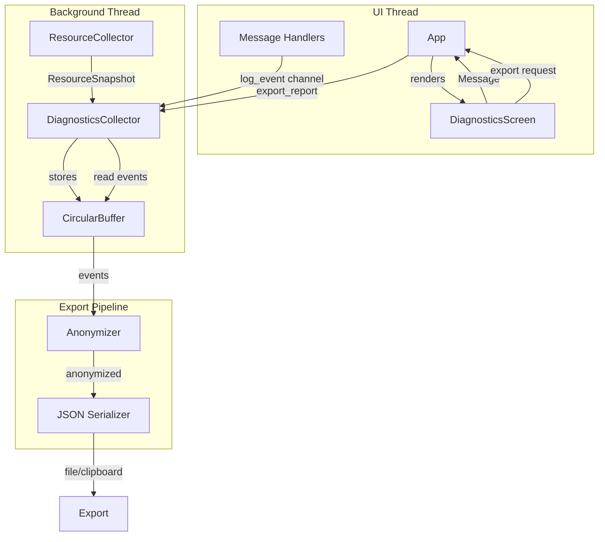

# IcedLens Diagnostics Tool - Brownfield Enhancement Architecture

**Version:** 1.0
**Date:** 2026-01-13
**Author:** Architect (BMAD Method)
**Status:** Draft

---

## Introduction

This document outlines the architectural approach for enhancing IcedLens with the **Diagnostics Tool** - an integrated performance monitoring and reporting system for developers and contributors. Its primary goal is to serve as the guiding architectural blueprint for AI-driven development while ensuring seamless integration with the existing system.

**Relationship to Existing Architecture:**
This document supplements the existing IcedLens architecture by defining how the new diagnostics module integrates with current systems. The design follows established patterns (Elm/Iced architecture, newtypes, design tokens) to maintain consistency.

### Existing Project Analysis

#### Current Project State

| Aspect | Current State |
|--------|---------------|
| **Primary Purpose** | Privacy-first media viewer and editor with AI enhancement capabilities |
| **Tech Stack** | Rust 1.92+, Iced 0.14.0, FFmpeg, ONNX Runtime |
| **Architecture Style** | Elm/Iced (Message → Update → View), modular monolith |
| **Deployment Method** | Desktop application (Linux, Windows, macOS) |

#### Available Documentation

- `CONTRIBUTING.md` - Development guidelines and patterns
- `CLAUDE.md` - AI assistant instructions with architecture overview
- `Cargo.toml` - Dependencies and project configuration

#### Identified Constraints

- **Privacy-first**: No automatic data transmission; user-initiated exports only
- **Performance budget**: Collection overhead must be < 1% CPU/RAM
- **Cross-platform**: Must work on Linux, Windows, macOS
- **Existing patterns**: Must follow Elm/Iced architecture, newtypes, design tokens
- **Thread safety**: UI must never block; background work on separate threads

### Change Log

| Change | Date | Version | Description | Author |
|--------|------|---------|-------------|--------|
| Initial | 2026-01-13 | 1.0 | Initial architecture document | Architect |

---

## Enhancement Scope and Integration Strategy

### Enhancement Overview

| Aspect | Value |
|--------|-------|
| **Enhancement Type** | New module addition (diagnostics) |
| **Scope** | Self-contained module with integration points in message handlers |
| **Integration Impact** | Low - additive changes, no breaking modifications |

### Integration Approach

| Layer | Strategy |
|-------|----------|
| **Code Integration** | New `src/diagnostics/` module; minimal changes to existing handlers |
| **Database Integration** | N/A - in-memory circular buffer only |
| **API Integration** | N/A - no external APIs |
| **UI Integration** | New `Diagnostics` screen; hamburger menu modification |

### Compatibility Requirements

| Aspect | Requirement |
|--------|-------------|
| **Existing API Compatibility** | Internal message system extended, not modified |
| **Database Schema Compatibility** | N/A |
| **UI/UX Consistency** | Follow existing screen patterns (About, Help, Settings) |
| **Performance Impact** | < 1% overhead in lightweight mode |

---

## Tech Stack

### Existing Technology Stack

| Category | Technology | Version | Usage in Enhancement | Notes |
|----------|------------|---------|---------------------|-------|
| Language | Rust | 1.92+ | All new code | Required |
| UI Framework | Iced | 0.14.0 | Diagnostics screen | Existing patterns |
| Serialization | serde, serde_json | 1.0 | JSON export | Already in project |
| Hashing | blake3 | 1.5 | Path anonymization | Already in project |
| Async Runtime | tokio | 1.48 | Collector thread | Already in project |
| File Dialog | rfd | 0.16 | File export location | Already in project |

### New Technology Additions

| Technology | Version | Purpose | Rationale | Integration Method |
|------------|---------|---------|-----------|-------------------|
| sysinfo | 0.32+ | System metrics (CPU, RAM, disk) | Cross-platform, well-maintained, Rust-native | Add to Cargo.toml |
| arboard | 3.4+ | Clipboard access | Cross-platform clipboard, Rust-native | Add to Cargo.toml |
| crossbeam-channel | 0.5+ | Thread communication | Fast, bounded channels for collector | Add to Cargo.toml |

---

## Data Models

### New Data Models

#### DiagnosticEvent

**Purpose:** Represents a single diagnostic event captured by the collector.

**Integration:** Stored in circular buffer, serialized to JSON on export.

**Key Attributes:**
- `timestamp`: `Instant` - When the event occurred
- `event_type`: `DiagnosticEventType` - Discriminant for event kind
- `data`: Event-specific payload

**Enum Variants:**
```rust
pub enum DiagnosticEvent {
    ResourceSnapshot(ResourceMetrics),
    UserAction(UserActionData),
    AppState(AppStateData),
    Operation(OperationData),
    Warning(DiagnosticWarning),
    Error(DiagnosticError),
}
```

#### ResourceMetrics

**Purpose:** System resource usage snapshot.

**Key Attributes:**
- `cpu_usage_percent`: `f32` - CPU usage percentage
- `memory_used_bytes`: `u64` - RAM currently used
- `memory_total_bytes`: `u64` - Total RAM available
- `disk_read_bytes`: `u64` - Disk read since last sample
- `disk_write_bytes`: `u64` - Disk write since last sample

#### UserActionData

**Purpose:** User interaction event.

**Key Attributes:**
- `action`: `UserAction` - Action type enum
- `details`: `Option<String>` - Additional context (anonymized)

#### AppStateData

**Purpose:** Application state transition.

**Key Attributes:**
- `state`: `AppStateType` - State enum
- `context`: `Option<String>` - Additional context (anonymized)

#### DiagnosticReport

**Purpose:** Complete export-ready report structure.

**Key Attributes:**
- `metadata`: `ReportMetadata` - Report identification and timing
- `system_info`: `SystemInfo` - Hardware/OS information
- `events`: `Vec<AnonymizedEvent>` - All captured events (anonymized)
- `summary`: `ReportSummary` - Aggregate statistics

### Schema Integration Strategy

| Aspect | Approach |
|--------|----------|
| **New Tables** | N/A - in-memory only |
| **Modified Tables** | N/A |
| **New Indexes** | N/A |
| **Migration Strategy** | N/A |

**Backward Compatibility:**
- No persistent storage changes
- JSON schema versioned for future compatibility

---

## Component Architecture

### New Components

#### DiagnosticsCollector

**Responsibility:** Core collector running on background thread, managing event capture and storage.

**Integration Points:**
- Receives events via channel from UI thread
- Provides state queries for UI
- Exports reports on demand

**Key Interfaces:**
- `start()` → Start collection
- `stop()` → Stop collection
- `log_event(DiagnosticEvent)` → Queue event for storage
- `export_report()` → Generate anonymized report
- `get_status()` → Query collector state

**Dependencies:**
- **Existing Components:** None (standalone)
- **New Components:** CircularBuffer, Anonymizer

**Technology Stack:** Rust, crossbeam-channel, sysinfo

---

#### CircularBuffer

**Responsibility:** Fixed-capacity event storage with oldest-first eviction.

**Integration Points:**
- Used by DiagnosticsCollector for event storage
- Provides iterator for export

**Key Interfaces:**
- `push(event)` → Add event, evict oldest if full
- `iter()` → Chronological iterator over events
- `len()` → Current event count
- `capacity()` → Maximum capacity
- `clear()` → Remove all events

**Dependencies:**
- **Existing Components:** None
- **New Components:** None

**Technology Stack:** Rust (VecDeque or custom ring buffer)

---

#### ResourceCollector

**Responsibility:** Periodic system metrics sampling on background thread.

**Integration Points:**
- Sends ResourceSnapshot events to DiagnosticsCollector
- Controlled via channel commands (start/stop)

**Key Interfaces:**
- `new(interval, sender)` → Create with sampling config
- `run()` → Start sampling loop (blocking)

**Dependencies:**
- **Existing Components:** None
- **New Components:** DiagnosticsCollector (via channel)

**Technology Stack:** sysinfo, tokio, crossbeam-channel

---

#### Anonymizer

**Responsibility:** Transform sensitive data into privacy-safe hashes.

**Integration Points:**
- Used by DiagnosticsCollector during export
- Applied to all string fields in events

**Key Interfaces:**
- `anonymize_path(path)` → Hash path, preserve extension
- `anonymize_identity(text)` → Detect and hash IPs, domains, usernames
- `anonymize_event(event)` → Full event anonymization

**Dependencies:**
- **Existing Components:** None
- **New Components:** None

**Technology Stack:** blake3

---

#### DiagnosticsScreen

**Responsibility:** UI screen for diagnostics controls and export.

**Integration Points:**
- Renders in main view when Screen::Diagnostics active
- Sends messages to App for collector control
- Displays status from collector state

**Key Interfaces:**
- `view(ctx)` → Render screen
- `Message` enum → User interactions
- `Event` enum → Parent notifications

**Dependencies:**
- **Existing Components:** I18n, Notifications, design_tokens
- **New Components:** DiagnosticsCollector (via App state)

**Technology Stack:** Iced widgets, design tokens

---

### Component Interaction Diagram



---

## Source Tree

### Existing Project Structure (Relevant Parts)

```
src/
├── app/
│   ├── message.rs          # Top-level Message enum
│   ├── update.rs           # Message handlers
│   ├── screen.rs           # Screen enum
│   └── ...
├── ui/
│   ├── mod.rs              # UI module exports
│   ├── about.rs            # About screen (reference pattern)
│   ├── settings.rs         # Settings screen
│   ├── help.rs             # Help screen
│   ├── design_tokens.rs    # Design system
│   ├── notifications/      # Toast notification system
│   └── ...
├── media/                  # Media handling
├── video_player/           # Video playback (newtypes here)
└── lib.rs                  # Library root
```

### New File Organization

```
src/
├── diagnostics/                    # NEW: Diagnostics module
│   ├── mod.rs                      # Module exports
│   ├── collector.rs                # DiagnosticsCollector
│   ├── buffer.rs                   # CircularBuffer<T>
│   ├── events.rs                   # DiagnosticEvent types
│   ├── resource_collector.rs       # System metrics collector
│   ├── anonymizer.rs               # Privacy anonymization
│   ├── report.rs                   # DiagnosticReport, JSON schema
│   └── export.rs                   # File and clipboard export
├── app/
│   ├── message.rs                  # MODIFY: Add Diagnostics variant
│   ├── update.rs                   # MODIFY: Add handler
│   └── screen.rs                   # MODIFY: Add Screen::Diagnostics
├── ui/
│   ├── mod.rs                      # MODIFY: Export diagnostics_screen
│   ├── diagnostics_screen.rs       # NEW: Diagnostics UI
│   └── navbar.rs                   # MODIFY: Add menu entry
└── lib.rs                          # MODIFY: Export diagnostics module
```

### Integration Guidelines

| Aspect | Guideline |
|--------|-----------|
| **File Naming** | Snake_case matching existing (e.g., `diagnostics_screen.rs`) |
| **Folder Organization** | New module in `src/diagnostics/`, screen in `src/ui/` |
| **Import/Export Patterns** | Re-export public API via `mod.rs`, use `pub(crate)` for internals |

---

## Infrastructure and Deployment Integration

### Existing Infrastructure

| Aspect | Current State |
|--------|---------------|
| **Current Deployment** | Desktop binary (cargo build --release) |
| **Infrastructure Tools** | Cargo, GitHub Actions CI |
| **Environments** | Development (debug), Release |

### Enhancement Deployment Strategy

| Aspect | Approach |
|--------|----------|
| **Deployment Approach** | No changes - module included in standard build |
| **Infrastructure Changes** | None required |
| **Pipeline Integration** | Existing CI will run new tests automatically |

### Rollback Strategy

| Aspect | Approach |
|--------|----------|
| **Rollback Method** | Feature can be disabled via feature flag if needed |
| **Risk Mitigation** | Collector disabled by default; opt-in activation |
| **Monitoring** | Manual testing; no runtime monitoring needed |

---

## Coding Standards

### Existing Standards Compliance

| Aspect | Standard |
|--------|----------|
| **Code Style** | `cargo fmt`, Clippy pedantic |
| **Linting Rules** | `#[warn(clippy::pedantic)]` in Cargo.toml |
| **Testing Patterns** | Unit tests in same file (`#[cfg(test)]` mod), integration tests in `tests/` |
| **Documentation Style** | Rustdoc with `//!` module docs, `///` item docs |

### Enhancement-Specific Standards

| Standard | Description |
|----------|-------------|
| **Newtype pattern** | Use for bounded values (BufferCapacity, SamplingInterval) |
| **Channel communication** | Use `crossbeam-channel` for thread communication |
| **Error handling** | Return `Result<T, DiagnosticsError>` for fallible operations |
| **Anonymization** | All string data must pass through Anonymizer before export |

### Critical Integration Rules

| Aspect | Rule |
|--------|------|
| **Existing API Compatibility** | Extend `Message` enum, don't modify existing variants |
| **Database Integration** | N/A |
| **Error Handling** | Use existing `Notification` system for user feedback |
| **Logging Consistency** | Use `log_event()` channel, not direct buffer access from UI thread |

---

## Testing Strategy

### Integration with Existing Tests

| Aspect | Current State |
|--------|---------------|
| **Existing Test Framework** | Rust built-in (`#[test]`), Criterion for benchmarks |
| **Test Organization** | Unit tests in-file, integration in `tests/` |
| **Coverage Requirements** | No formal coverage target, but comprehensive unit tests expected |

### New Testing Requirements

#### Unit Tests for New Components

| Aspect | Requirement |
|--------|-------------|
| **Framework** | Rust `#[test]`, `approx` for float comparison |
| **Location** | `#[cfg(test)] mod tests` in each source file |
| **Coverage Target** | All public APIs, edge cases for buffer/anonymizer |
| **Integration with Existing** | Run with `cargo test` |

**Required Unit Tests:**
- `buffer.rs`: Add, overflow, iteration, clear, capacity
- `anonymizer.rs`: Path hashing, extension preservation, IP detection, username detection
- `events.rs`: Serialization roundtrip for all variants
- `report.rs`: JSON schema validation
- `collector.rs`: Start/stop, event logging, export

#### Integration Tests

| Aspect | Requirement |
|--------|-------------|
| **Scope** | Full pipeline: collect → buffer → anonymize → export |
| **Existing System Verification** | Ensure diagnostics don't affect normal app operation |
| **New Feature Testing** | End-to-end export produces valid, anonymized JSON |

#### Regression Testing

| Aspect | Requirement |
|--------|-------------|
| **Existing Feature Verification** | Run full test suite before merge |
| **Automated Regression Suite** | `cargo test --all` in CI |
| **Manual Testing Requirements** | Cross-platform clipboard, UI navigation |

---

## Security Integration

### Existing Security Measures

| Aspect | Current State |
|--------|---------------|
| **Authentication** | N/A (desktop app) |
| **Authorization** | N/A |
| **Data Protection** | Privacy-first design, no telemetry |
| **Security Tools** | `cargo audit` for dependency vulnerabilities |

### Enhancement Security Requirements

| Aspect | Requirement |
|--------|-------------|
| **New Security Measures** | Mandatory anonymization before any export |
| **Integration Points** | Anonymizer applied in export pipeline, not bypassable |
| **Compliance Requirements** | GDPR-compatible (no PII in exports) |

### Security Testing

| Aspect | Requirement |
|--------|-------------|
| **Existing Security Tests** | `cargo audit` in CI |
| **New Security Test Requirements** | Unit tests verify anonymization removes all PII patterns |
| **Penetration Testing** | N/A (local-only tool) |

---

## Detailed Design Specifications

### Newtypes

Following the established pattern (see `src/video_player/frame_cache_size.rs`):

#### BufferCapacity

```rust
// src/diagnostics/buffer.rs

use crate::config::defaults::{
    DEFAULT_DIAGNOSTICS_BUFFER_EVENTS,
    MIN_DIAGNOSTICS_BUFFER_EVENTS,
    MAX_DIAGNOSTICS_BUFFER_EVENTS,
};

/// Circular buffer capacity in number of events.
#[derive(Debug, Clone, Copy, PartialEq, Eq)]
pub struct BufferCapacity(usize);

impl BufferCapacity {
    #[must_use]
    pub fn new(value: usize) -> Self {
        Self(value.clamp(MIN_DIAGNOSTICS_BUFFER_EVENTS, MAX_DIAGNOSTICS_BUFFER_EVENTS))
    }

    #[must_use]
    pub fn value(self) -> usize {
        self.0
    }
}

impl Default for BufferCapacity {
    fn default() -> Self {
        Self(DEFAULT_DIAGNOSTICS_BUFFER_EVENTS)
    }
}
```

#### SamplingInterval

```rust
// src/diagnostics/resource_collector.rs

use std::time::Duration;

/// Resource sampling interval.
#[derive(Debug, Clone, Copy, PartialEq, Eq)]
pub struct SamplingInterval(Duration);

impl SamplingInterval {
    pub const MIN: Duration = Duration::from_millis(100);
    pub const MAX: Duration = Duration::from_secs(10);
    pub const DEFAULT: Duration = Duration::from_secs(1);

    #[must_use]
    pub fn new(duration: Duration) -> Self {
        Self(duration.clamp(Self::MIN, Self::MAX))
    }

    #[must_use]
    pub fn value(self) -> Duration {
        self.0
    }
}

impl Default for SamplingInterval {
    fn default() -> Self {
        Self(Self::DEFAULT)
    }
}
```

### Message Integration

```rust
// src/app/message.rs (additions)

pub enum Message {
    // ... existing variants ...

    /// Diagnostics screen messages
    Diagnostics(diagnostics_screen::Message),

    /// Diagnostics collector status update (from subscription)
    DiagnosticsStatusUpdate(DiagnosticsStatus),

    /// Export completed
    DiagnosticsExportCompleted(Result<ExportResult, String>),
}
```

### Screen Integration

```rust
// src/app/screen.rs (modification)

#[derive(Debug, Clone, Copy, PartialEq, Eq)]
pub enum Screen {
    Viewer,
    Settings,
    ImageEditor,
    Help,
    About,
    Diagnostics,  // NEW
}
```

### JSON Schema

```json
{
  "schema_version": "1.0",
  "metadata": {
    "report_id": "uuid-v4",
    "generated_at": "2026-01-13T14:30:00Z",
    "iced_lens_version": "0.6.0",
    "collection_started_at": "2026-01-13T14:25:00Z",
    "collection_duration_ms": 300000,
    "event_count": 847
  },
  "system_info": {
    "os": "Linux",
    "os_version": "6.14.0",
    "cpu_model": "AMD Ryzen 7 5800X",
    "cpu_cores": 8,
    "ram_total_mb": 32768,
    "disk_type": "SSD"
  },
  "events": [
    {
      "timestamp_ms": 0,
      "type": "resource_snapshot",
      "data": {
        "cpu_percent": 12.5,
        "ram_used_mb": 1024,
        "ram_total_mb": 32768,
        "disk_read_kb": 0,
        "disk_write_kb": 128
      }
    },
    {
      "timestamp_ms": 150,
      "type": "user_action",
      "data": {
        "action": "navigate_next",
        "details": null
      }
    },
    {
      "timestamp_ms": 200,
      "type": "app_state",
      "data": {
        "state": "media_loading_started",
        "context": "a1b2c3d4.jpg"
      }
    }
  ],
  "summary": {
    "event_counts": {
      "resource_snapshot": 300,
      "user_action": 45,
      "app_state": 120,
      "operation": 380,
      "warning": 2,
      "error": 0
    },
    "resource_stats": {
      "cpu_min": 2.1,
      "cpu_max": 85.3,
      "cpu_avg": 15.7,
      "ram_min_mb": 512,
      "ram_max_mb": 2048,
      "ram_avg_mb": 1024
    }
  }
}
```

### Anonymization Rules

| Data Type | Detection | Transformation |
|-----------|-----------|----------------|
| File paths | Contains `/` or `\` | Hash each segment, preserve extension |
| IPv4 | Regex `\d{1,3}\.\d{1,3}\.\d{1,3}\.\d{1,3}` | Hash entire match |
| IPv6 | Regex `[0-9a-fA-F:]{2,39}` | Hash entire match |
| Domain | Regex `[a-zA-Z0-9-]+\.[a-zA-Z]{2,}` | Hash entire match |
| Username | Equals `whoami()` or common patterns | Hash entire match |

**Hash format:** First 8 characters of blake3 hash (e.g., `a1b2c3d4`)

---

## Checklist Results Report

*To be completed after architecture review and before implementation.*

---

## Next Steps

### Story Manager Handoff

> The Diagnostics Tool architecture is complete. Begin implementation with Epic 1, Story 1.1 (Module Structure and Circular Buffer). Key integration requirements:
>
> - Create `src/diagnostics/` module following existing patterns
> - Use newtype pattern for `BufferCapacity`
> - Ensure all public APIs are documented with rustdoc
> - Unit tests required for buffer operations
>
> Reference this architecture document for component design. The first story establishes the foundation; subsequent stories build incrementally.

### Developer Handoff

> **Architecture Reference:** `docs/architecture.md`
>
> **Key Technical Decisions:**
> 1. Collector runs on background thread with channel communication
> 2. Events stored in generic `CircularBuffer<T>` (reusable)
> 3. Anonymization applied at export time, not collection time
> 4. Follow existing newtype pattern (see `src/video_player/frame_cache_size.rs`)
> 5. Follow existing screen pattern (see `src/ui/about.rs`)
>
> **Implementation Sequence:**
> 1. Epic 1: Core module, buffer, collectors (can test without UI)
> 2. Epic 2: Anonymization, export (can test via unit tests)
> 3. Epic 3: UI integration (requires Epic 1-2 complete)
>
> **Dependencies to Add:**
> ```toml
> sysinfo = "0.32"
> arboard = "3.4"
> crossbeam-channel = "0.5"
> ```
>
> **Verification:** Run `cargo test --all` and `cargo clippy --all` after each story.

---

*Generated using the BMAD-METHOD Brownfield Architecture Template v2.0*
