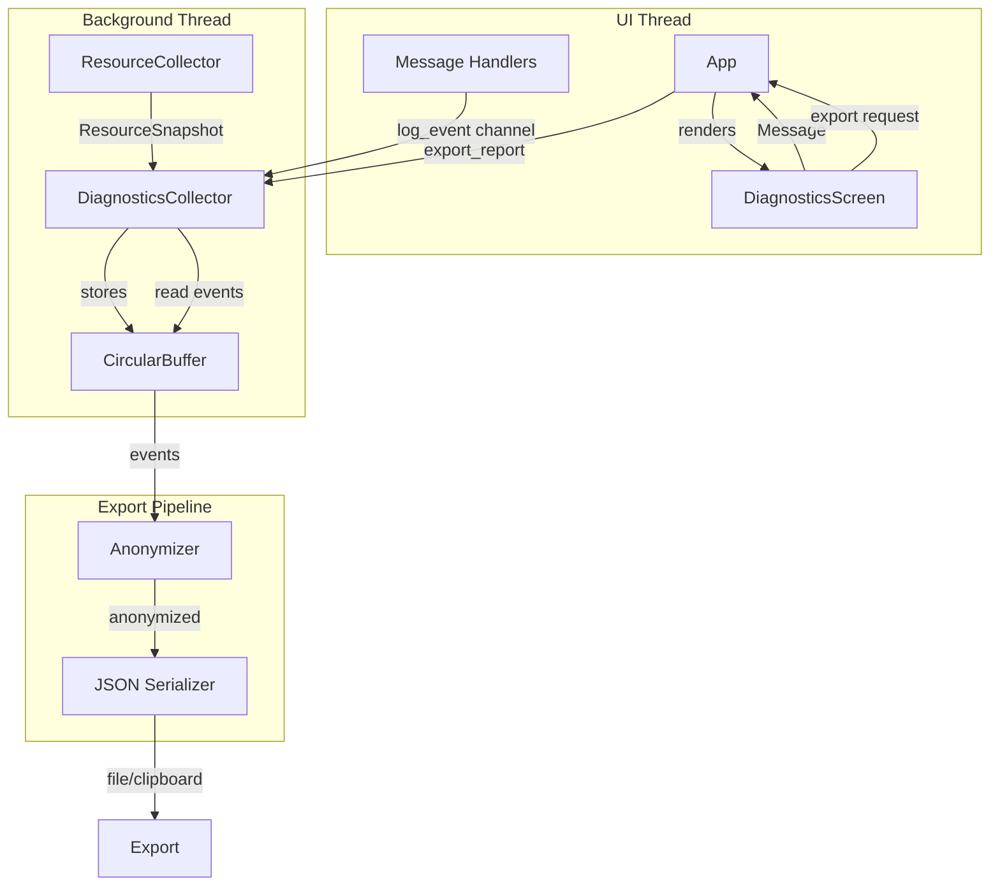

# Component Architecture

## New Components

### DiagnosticsCollector

**Responsibility:** Core collector running on background thread, managing event capture and storage.

**Integration Points:**
- Receives events via channel from UI thread
- Provides state queries for UI
- Exports reports on demand

**Key Interfaces:**
- `start()` → Start collection
- `stop()` → Stop collection
- `log_event(DiagnosticEvent)` → Queue event for storage
- `export_report()` → Generate anonymized report
- `get_status()` → Query collector state

**Dependencies:**
- **Existing Components:** None (standalone)
- **New Components:** CircularBuffer, Anonymizer

**Technology Stack:** Rust, crossbeam-channel, sysinfo

---

### CircularBuffer

**Responsibility:** Fixed-capacity event storage with oldest-first eviction.

**Integration Points:**
- Used by DiagnosticsCollector for event storage
- Provides iterator for export

**Key Interfaces:**
- `push(event)` → Add event, evict oldest if full
- `iter()` → Chronological iterator over events
- `len()` → Current event count
- `capacity()` → Maximum capacity
- `clear()` → Remove all events

**Dependencies:**
- **Existing Components:** None
- **New Components:** None

**Technology Stack:** Rust (VecDeque or custom ring buffer)

---

### ResourceCollector

**Responsibility:** Periodic system metrics sampling on background thread.

**Integration Points:**
- Sends ResourceSnapshot events to DiagnosticsCollector
- Controlled via channel commands (start/stop)

**Key Interfaces:**
- `new(interval, sender)` → Create with sampling config
- `run()` → Start sampling loop (blocking)

**Dependencies:**
- **Existing Components:** None
- **New Components:** DiagnosticsCollector (via channel)

**Technology Stack:** sysinfo, tokio, crossbeam-channel

---

### Anonymizer

**Responsibility:** Transform sensitive data into privacy-safe hashes.

**Integration Points:**
- Used by DiagnosticsCollector during export
- Applied to all string fields in events

**Key Interfaces:**
- `anonymize_path(path)` → Hash path, preserve extension
- `anonymize_identity(text)` → Detect and hash IPs, domains, usernames
- `anonymize_event(event)` → Full event anonymization

**Dependencies:**
- **Existing Components:** None
- **New Components:** None

**Technology Stack:** blake3

---

### DiagnosticsScreen

**Responsibility:** UI screen for diagnostics controls and export.

**Integration Points:**
- Renders in main view when Screen::Diagnostics active
- Sends messages to App for collector control
- Displays status from collector state

**Key Interfaces:**
- `view(ctx)` → Render screen
- `Message` enum → User interactions
- `Event` enum → Parent notifications

**Dependencies:**
- **Existing Components:** I18n, Notifications, design_tokens
- **New Components:** DiagnosticsCollector (via App state)

**Technology Stack:** Iced widgets, design tokens

---

## Component Interaction Diagram

---
